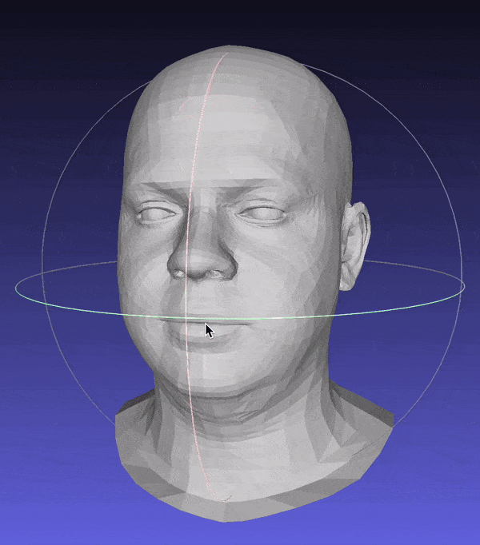
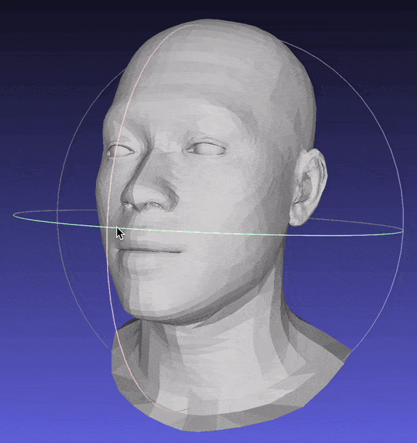
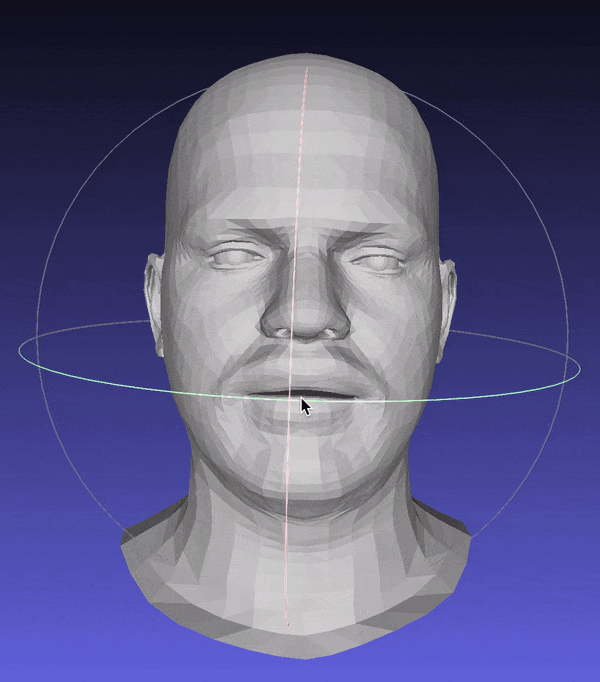

# 3D Face Reconstruction from iPhone's TrueDepth Sensor

Building the app in xcode

1. Install latest version of xcode
2. Clone the repo
3. Open the project file 3DFR True Depth.xcodeproj in xcode.
4. Double click on 3DFR TrueDepth on the left.
   
5. Under Signing & Certificates, sign into and select you Apple Developer account.
   
6. Follow this guide to enable devloper mode and connect iPhone to mac https://docs.expo.dev/guides/ios-developer-mode/
7. Make sure your phone is selected in the target menu.
   
8. Click Product -> Run, or the play icon on the top left to build and install the app to the iPhone.
   
   
9. Once installed go to Settings -> General -> VPN & Device Management -> Devleloper App -> Trust App
   

